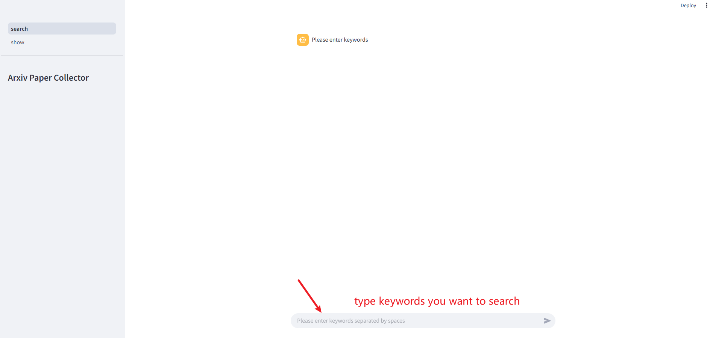
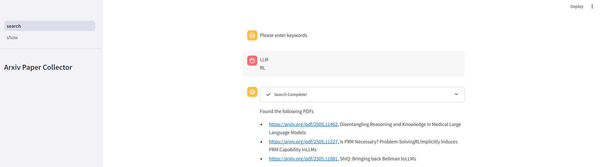
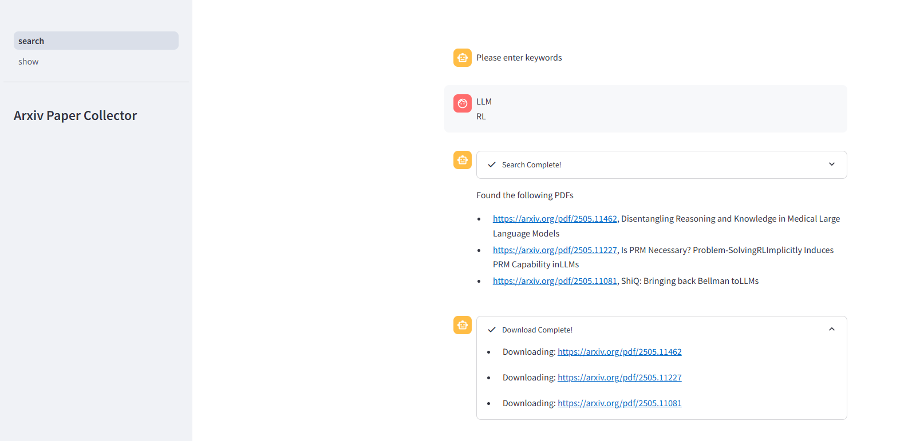

<center><h2>🚀 LLM-ArxivPaper: Gather Arxiv papers, enhance reading via LLMs</h2></center>

## 🎉 News
- [ ] [2025.5.30] 📚 TODO: Enable interactive Q&A with LLM for scraped papers — ask questions about the paper's key points, methods, results, and more in a conversational format!
- [X] [2025.05.19]🎯📢LLM-ArxivPaper now supports displaying scraped Arxiv papers via Web UI.
- [X] [2025.05.18]🎯📢LLM-ArxivPaper now supports automated Arxiv paper scraping via Web UI.

## 🛠️ Installation
### Install Dependencies
```shell
git clone https://github.com/gxlover0625/LLM-ArxivPaper.git
cd LLM-ArxivPaper
pip install -r requirements.txt
```
### Install Chrome
Since LLM-ArxivPaper requires the use of Chrome for web crawling, it is necessary to install Chrome on the Linux system. The ways to install Chrome vary across different systems. Here, we demonstrate the installation method for `Ubuntu systems` without using sudo privileges.
```shell
mkdir -p ~/software/chrome  # replace the path you want to install
cd ~/software
wget https://dl.google.com/linux/google-chrome-stable_current_amd64.deb
dpkg-deb -x google-chrome-stable_current_amd64.deb ~/software/chrome
```
Now, you can find chrome in the `~/software/chrome/opt/google/chrome/chrome`. Next, create a `.env` file in the LLM-ArxivPaper directory and add the following environment variables to the `.env` file.
```
chrome_bin=~/software/chrome/opt/google/chrome/chrome
```

## ⚡ Quick Start
> [!IMPORTANT]
> Please make sure to install dependencies and chrome correctly according to `Installation` section.

Create a `.env` file and set important variables like below.
```
chrome_bin=~/software/chrome/opt/google/chrome/chrome
```
Now you can enjoy your journey with LLM-ArxivPaper simply using the following commands.
```shell
streamlit run main.py
```
You can access our web UI by visiting the URL http://localhost:8501/

## 💡 Features
### Scrape article
- Please enter `keywords` in the input bar at the bottom, separating multiple keywords with spaces, such as `LLM RL`.

- The program will automatically run the crawler to search for the latest papers on the arXiv website based on the keywords provided.

- To ensure a smooth user experience in the frontend, we have set the maximum number of displayed items to `3` in the configuration file config.yaml. However, the crawler actually retrieves `25` paper links. You can modify this setting at startup if needed.

- The program will download the papers based on the crawled article links and save them to the local directory `./data`. Among these, `./data/paper.html` contains the HTML content of the crawled webpage, and `./data/save_pdfs` stores the locally downloaded papers.


## 📧 Contact
LLM-ArxivPaper is currently under active development. Your feedback and contributions are highly valued!

- 🐛 **Have suggestions or found a bug?**  
  Feel free to [submit an issue](https://github.com/gxlover0625/LLM-ArxivPaper/issues ) — we appreciate your input!

- 😊  **Interested in contributing?**  
  We warmly welcome you to [submit a pull request (PR)](https://github.com/gxlover0625/LLM-ArxivPaper/pulls ). Your contributions can make a big difference.

We are committed to continuously improving this project and will keep a close eye on all issues and PRs. If you find this project helpful, please consider giving it a star! ⭐