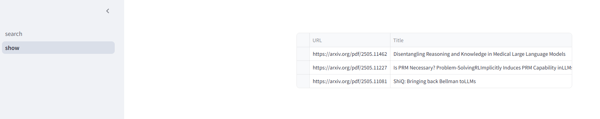
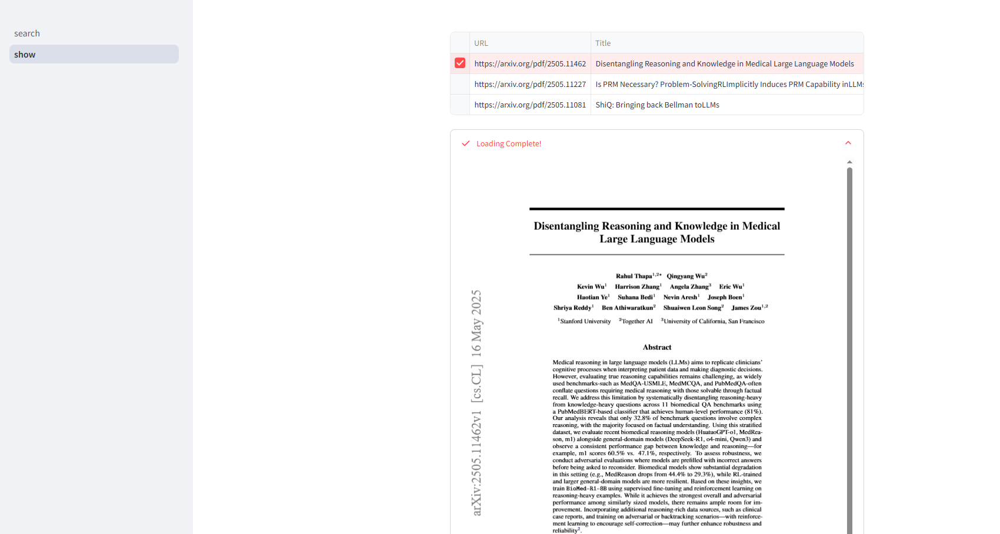

<center><h2>🚀 LLM-ArxivPaper: 收集Arxiv论文，通过LLM提升阅读体验</h2></center>
<div align="center">
<a href="README.md"><strong>English Doc</strong></a>
</div>

## 🎉 更新日志
- [ ] [2025.5.30] 📚 TODO: 为爬取的论文启用交互式问答功能 —— 可以以对话形式询问论文的关键点、方法、结果等内容！
- [X] [2025.05.19]🎯📢LLM-ArxivPaper 现在支持通过Web UI显示抓取的Arxiv论文。
- [X] [2025.05.18]🎯📢LLM-ArxivPaper 现在支持通过Web UI自动抓取Arxiv论文。

## 🛠️ 安装
### 安装依赖
```shell
git clone https://github.com/gxlover0625/LLM-ArxivPaper.git  
cd LLM-ArxivPaper
pip install -r requirements.txt
```

### 安装Chrome
由于LLM-ArxivPaper需要使用Chrome进行网页抓取，因此需要在Linux系统上安装Chrome。不同系统的安装方式有所不同。以下是针对`Ubuntu系统`且不使用sudo权限的安装方法。
```shell
mkdir -p ~/software/chrome  # 替换为你想安装的路径
cd ~/software
wget https://dl.google.com/linux/google-chrome-stable_current_amd64.deb  
dpkg-deb -x google-chrome-stable_current_amd64.deb ~/software/chrome
```
现在你可以在 `~/software/chrome/opt/google/chrome/chrome` 找到Chrome。接下来，在LLM-ArxivPaper目录下创建一个 `.env` 文件，并将以下环境变量添加到 `.env` 文件中：
```
chrome_bin=~/software/chrome/opt/google/chrome/chrome
```

## ⚡ 快速开始
> [!重要]
> 请确保根据 `安装` 部分正确安装依赖和Chrome。

创建一个 `.env` 文件并设置如下重要变量：
```
chrome_bin=~/software/chrome/opt/google/chrome/chrome
```
现在你可以通过以下命令轻松开始使用LLM-ArxivPaper：
```shell
streamlit run main.py
```
通过访问URL http://localhost:8501/ 来使用我们的Web UI。

## 💡 功能
### 抓取论文
- 在底部输入框中输入 `关键词`，多个关键词用空格分隔，例如 `LLM RL`。

- 程序将根据提供的关键词自动运行爬虫，在arXiv网站上搜索最新的论文。

- 为了确保前端用户体验流畅，我们在配置文件 `config.yaml` 中设置了最多显示 `3` 条结果。然而，爬虫实际上会抓取 `25` 条论文链接。如果需要，你可以在启动时修改此设置。

- 程序会根据抓取的论文链接下载论文，并将其保存到本地目录 `./data` 中。其中，`./data/paper.html` 包含抓取网页的HTML内容，`./data/save_pdfs` 存储本地下载的论文。


### 显示论文
- 点击侧边栏中的 `显示` 按钮，进入论文展示页面。页面会显示一个表格，包含三列：论文的URL、论文标题以及本地存储路径。

- 点击表格中的某一行，将显示抓取论文的全文内容。


## 📧 联系我们
LLM-ArxivPaper 正在积极开发中，您的反馈和贡献对我们非常重要！

- 🐛 **有建议或发现Bug？**  
  随时 [提交问题](https://github.com/gxlover0625/LLM-ArxivPaper/issues) —— 我们非常感谢您的意见！

- 😊 **有兴趣参与贡献？**  
  我们热烈欢迎您 [提交拉取请求 (PR)](https://github.com/gxlover0625/LLM-ArxivPaper/pulls)。您的贡献可能会带来巨大影响！

我们将致力于持续改进这个项目，并密切关注所有问题和PR。如果您觉得这个项目有帮助，请考虑给它点个星！⭐